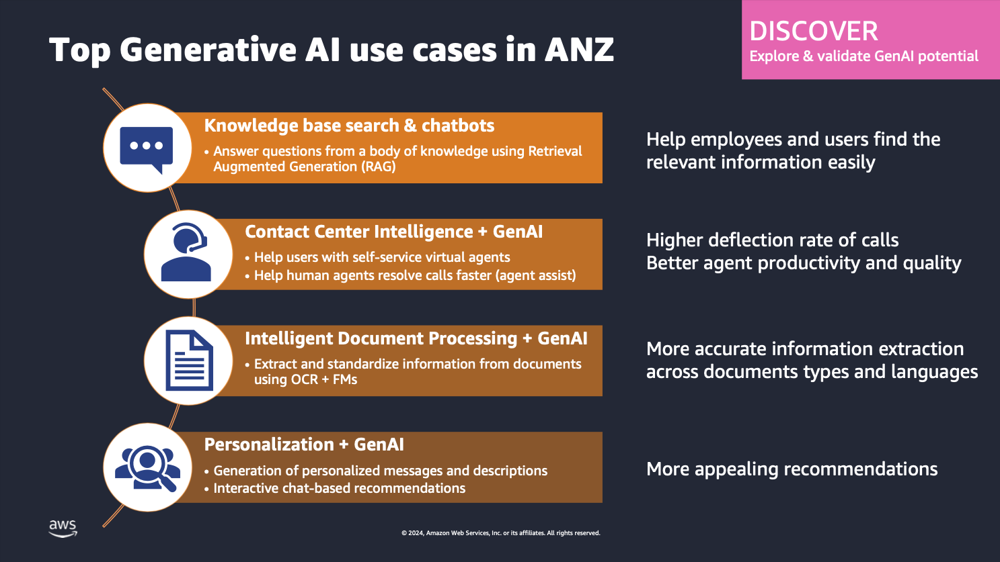

# Code.Sydney and Generative AI

Here in [Code.Sydney](https://www.code.sydney/), we are building a **learning** and **collaborative** community around technologies such as web, mobile, data, and in this latest initiative, Generative AI.

# Generative AI Building Blocks

In 2024, the top Generative use cases in ANZ according to AWS:

- **Knowledge base search & chatbots**
- Contact Center Intelligence + GenAI
- Intelligent Document Processing + GenAI
- Personalization + GenAI

If you look at following image, you can see that **Knowledge base search & chatbots** is the top use case for Generative AI. The tech landscape is changing rapidly and we need to keep up with the latest trends. Instead of tackling all these use cases, it is better to focus on one use case and become an expert in that area.



So, for the next few weeks, Code.Sydney will be focusing on learning the building blocks of Generative AI to enable us to build solutions in the **Knowledge base search & chatbots** area.

This will be a progressive learning journey where we will start with the basics and gradually build up our knowledge and skills in Generative AI, with the aim of enabling our members to build their own end to end Generative AI solutions.

# Course Prerequisites
- Basic understanding of software development
- Basic Python programming skills
- Basic understanding of Git
- Basic understanding of Jupyter Notebooks
- Basic understanding of Docker
- Basic understanding of SQL
- Windows PC, Mac or Linux machine with at least 32 GB RAM
- Stable internet connection
- Willingness to learn and collaborate

# Generative AI Learning Path

We will be following the learning path below:

[**Module 1** Fundamentals](module-1/README.md)
- Software Development Fundamentals
- Git Basics
- Python Basics
- Jupyter Notebooks
- Preparing your Python environment
- Introduction to Generative AI Learning Path

[**Module 2** Generative AI Basics](module-2/README.md)
- Introduction to Generative AI
- Access to LLM using Python
- Online vs Local LLM
- Setting up your local LLM
- Generative AI Libraries (eg. LangChain and LlamaIndex)

[**Project 1** Local LLM Mini project](.)
- Setting up your Local LLM
- Build a simple chatbot using Local LLM
- Deliverables:
    - Jupyter notebook chatbot using LangChain and another one using LlamaIndex
    - Documentation on how to setup Local LLM and run the chatbot
    - personal Github repo with your chatbot project
    - Assume you are presenting this to a client

[**Module 3** Vector Databases](module-3/README.md)
- Introduction to Vector Databases
- Get to know 2 popular Vector Databases (PgVector and ChromaDB)
- Setting up PgVector and ChromaDB
- Accessing PgVector and ChromaDB using LlamaIndex or LangChain
- Ingestion of your dataset

[**Module 4** Retrieval-Augmented Generation (RAG)](module-4/README.md)
- Introduction to RAG
- Basic RAG in LlamaIndex and LangChain
- Chunking strategies
- Embedding model selection

[**Project 2** RAG Mini project](.)
- Build a simple RAG model using LlamaIndex and LangChain

[**Module 5** Advanced RAG](module-5/README.md)
- RAG failure modes
- Advanced RAG strategies
- Metadata filtering and RAG
- RAG with multiple documents

[**Project 3** Advanced RAG project](.)
- Build a Chatbot that works for Complex queries and against multiple documents

**Module 6** Frontend options
- Introduction to Frontend options
- StreamLit
- NextJS
- ReactJS

**Module 7** Backend options
- Introduction to Backend options
- Flask
- FastAPI
- DJango

**Project 4** End to End Generative AI project
- document ingestion pipeline
- FrontEnd + Backend + Local LLM + Vector Database + RAG

# Environment setup
- use `pyenv` to manage python versions
- use `venv` to manage your virtual environments

```bash
pyenv versions
pyenv install 3.12.2
pyenv local 3.12.2
python -m venv .venv
source .venv/bin/activate
``` 